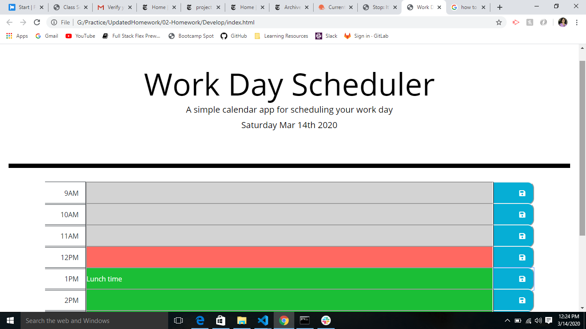
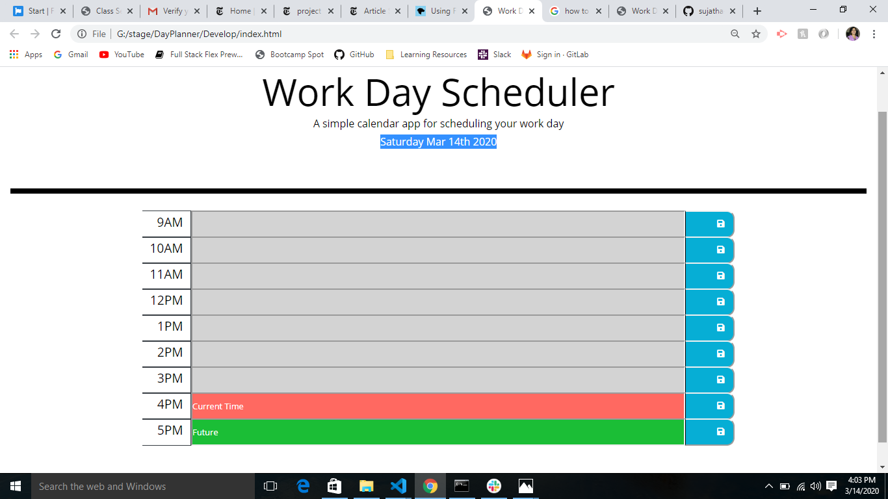
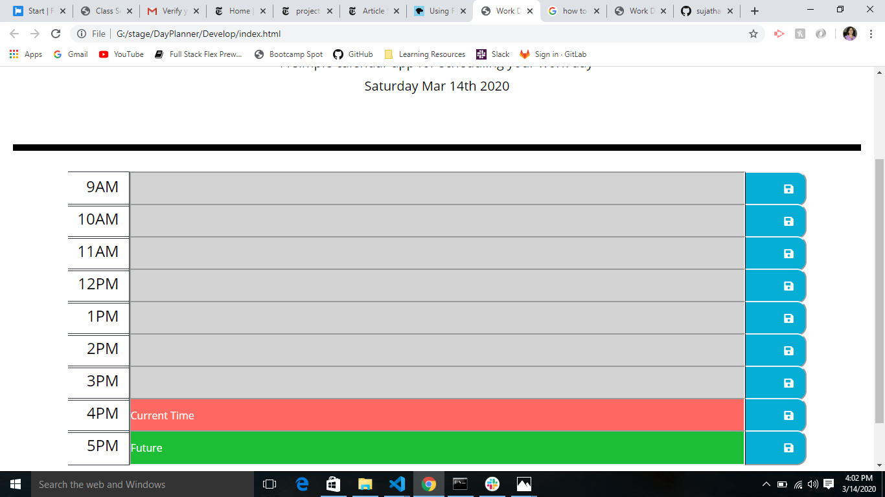
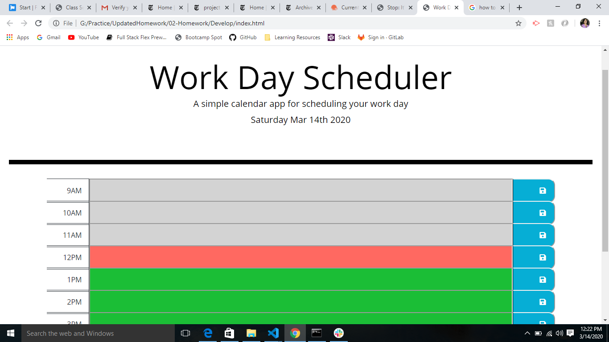
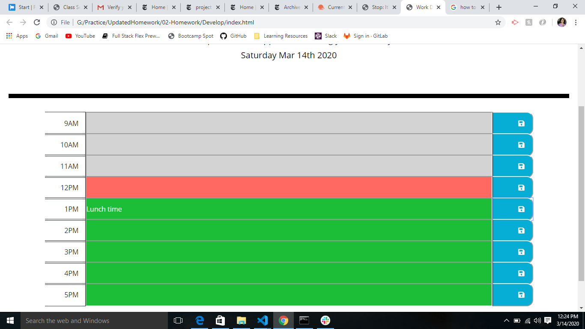

# Work Day Scheduler

**Deployed Web URL**
https://sujatha-m.github.io/DayPlanner/Develop/

## Overview 
An application that allows user to plan his work day schedule by adding events to 
each hour of the day.

The following criteria are satisfied to accomplish the overall behavior:-

1. current day is displayed at the top of the calendar
2. on scrolling down user is presented with timeblocks for standard business hours
3. based on the current time,the timeblocks are color coded as present,past or future
4. clicking on a timeblock allows the user to enter and save an event for that timeslot
5. the events persist on page refresh

This app runs in the browser and features dynamically updated HTML and CSS powered by JavaScript
code. It also features a clean,polished 
and responsive user interface, ensuring that it adapts to multiple screen sizes.

## Functionality
The timeslots are color coded as green for future,red for current and grey for past.
Each of the timeslots could contain an event scheduled by the user.
Event addition is allowed only for future timeslots and not for present or past timeslots.
This implies that the save button is deactivated for present and past timeslots and only available for
future timeslots.
When user enters an event into the future timeslot and clicks on the save button,the data is saved onto
local storage.
The calendar entries are processed by getting the events from local storage and comparing the timeslots 
against current time to determine if the timeslot needs to be displayed as past,present or future entry.

The following images demonstrate the application functionality:

